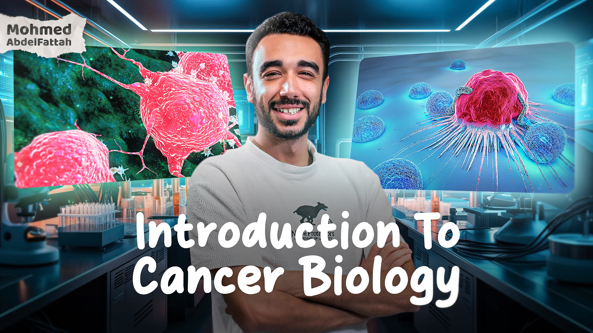

# 🧬 Introduction to Cancer Biology

Welcome to the **Introduction to Cancer Biology** course! This  course is structured to give participants a deep understanding of cancer biology, exploring everything from fundamental principles to advanced research topics. Each week, we will cover different aspects of cancer biology, from cellular mechanisms to therapeutic strategies.

## 📅 Course Overview

- **Duration**: 6 weeks
- **Preparation** 15-day program designed for participants without a molecular biology background before the course (Optional)
- **Weekly Lecture**: One 3-hour session covering core concepts
- **Advanced Topics**: One 1-hour session each week for in-depth discussions on advanced topics
- **One-on-One Meetings**: Available upon request for personalized guidance or deeper exploration of topics

This course aims to equip you with knowledge and insights that will enable you to understand and interpret cancer biology research effectively. The course materials, assignments, and interactive sessions are designed to ensure a solid grasp of key topics and the latest developments in the field.

---
### About the Instructor: Mohmed Abdalfttah

Mohmed has a background in Biotechnology, Computational Biology, and Cancer Research. Here’s a summary of his career journey:

- **November 1998**: Born in Egypt.
- **June 2021**: Graduated with a Bachelor’s degree in Biotechnology from Ain Shams University, Egypt.
- **September 2021 - March 2022**: Completed a six-month internship in computational epigenomics, focusing on developing a cell-cell communication algorithm using bulk and single-cell transcriptomic data.
- **June 2022**: Moved to Barcelona to work as a Computational Biologist, contributing to research projects on breast cancer and brain metastasis, with a focus on the tumor microenvironment using single-cell data and spatial transcriptomics.
- **September 2023 - July 2024**: Pursued a Master’s degree at the Universitat Pompeu Fabra, with a thesis focusing on the tumor microenvironment and cancer cell heterogeneity in colorectal cancer through single-cell and spatial transcriptomics in Institute for Research in Biomedicine, Barcelona.
- **September 2024**: Began a PhD at the National Cancer Research Center (CNIO) and the Faculty of Medicine at Universidad Autónoma de Madrid, specializing in brain metastasis research with a focus on cancer cell heterogeneity and the tumor microenvironment using single-cell and spatial genomics.

Mohmed’s experience and expertise in computational biology, single-cell genomics, and cancer research bring valuable insights into this course.
---
## 👥 Who Can Join the Course?

This course is open to anyone interested in cancer biology, especially:

- **Undergraduate and Graduate Students**: Ideal for those studying biomedical sciences, biotechnology, or related fields.
- **Early Career Researchers**: Suitable for researchers new to cancer biology or those transitioning into this field.
- **Enthusiastic Learners**: Anyone with a passion for understanding the complexities of cancer at the cellular level.

No prior experience in cancer research is required, though a basic understanding of Molecular Biology will be helpful!

## 📘 Don't Have a Background in Molecular Biology?

No worries! We've got you covered. For those who need a foundation in molecular biology, we offer a **15-day preparatory program** to help you get up to speed before diving into cancer biology. **This program is included in the course fees, with no additional charges.**

### Molecular Biology Basics

In this program, you'll follow along with Mohmed Abdalfttah's **YouTube playlist** covering essential topics:

1. **DNA Structure and Analysis**
2. **DNA Replication**
3. **DNA Transcription**

We'll provide structured tasks and one-on-one support, ensuring you understand each concept. This preparatory phase is designed to build your confidence and equip you with the knowledge needed to fully engage with the main cancer biology course.

Join us in this learning journey and become well-prepared for the next step in understanding cancer biology!

## 💵 Fees
- **Early Registration**: 1000 EGP (from mid-November to mid-December)
- **Regular Registration**: 1200 EGP (from mid-December to mid-January)
- **Late Registration**: 1500 EGP (from mid-January to January 25)

## 💳 How to Pay
- **📲 Vodafone Cash**
- **📱 InstaPay**
- **🏦 Bank Transfer**

## 🚀 How to Join the Course

This course is open for registration. Please **contact me** if you're interested in enrolling, or open an issue in this repository for general questions.

If you’re enthusiastic about gaining insights into cancer biology and ready to explore both theoretical and practical aspects, we look forward to having you on board!
