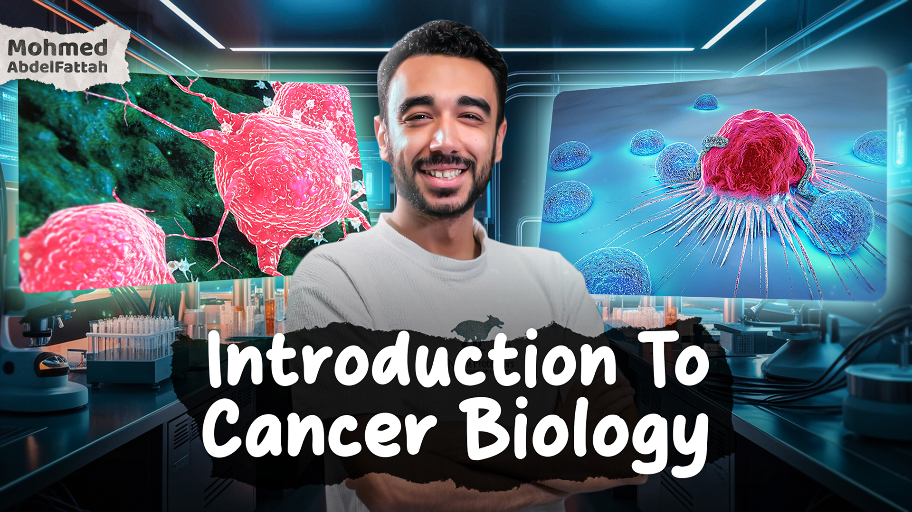

# 🧬 Introduction to Cancer Biology

Welcome to the **Introduction to Cancer Biology** course! This  course is structured to give participants a deep understanding of cancer biology, exploring everything from fundamental principles to advanced research topics. Each week, we will cover different aspects of cancer biology, from cellular mechanisms to therapeutic strategies.

## 📅 Course Overview
- **When?** 25-01-2025
- **Where?** Online
- **Duration**: 6 weeks
- **Weekly Lecture**: One 3-hour session covering core concepts
- **Advanced Topics**: One 1-hour session each week for in-depth discussions on advanced topics
- **One-to-One Meetings**: Available upon request for personalized guidance or deeper exploration of topics

This course aims to equip you with knowledge and insights that will enable you to understand and interpret cancer biology research effectively. The course materials, assignments, and interactive sessions are designed to ensure a solid grasp of key topics and the latest developments in the field.

## 👨‍🏫 About the Instructor: Mohmed Abdalfttah

Mohmed has a background in Biotechnology, Computational Biology, and Cancer Research. Here’s a summary of his career journey:

- **November 1998**: Born in Egypt.
- **June 2021**: Graduated with a Bachelor’s degree in Biotechnology from Ain Shams University, Egypt.
- **September 2021 - March 2022**: Completed a six-month internship in computational epigenomics at Helmholtz Munich, focusing on developing a cell-cell communication algorithm using bulk and single-cell transcriptomic data.
- **June 2022**: Moved to Barcelona to work as a Computational Biologist, contributing to research projects on breast cancer and brain metastasis, with a focus on the tumor microenvironment.
- **September 2023**: Pursued a Master’s degree at Universitat Pompeu Fabra, focusing on a thesis exploring the tumor microenvironment and cancer cell heterogeneity in colorectal cancer through single-cell and spatial transcriptomics at the Institute for Research in Biomedicine (IRB) in Barcelona.
- **September 2024**: Began a PhD at the National Cancer Research Center (CNIO) and the Faculty of Medicine at Universidad Autónoma de Madrid, specializing in brain metastasis research with a focus on cancer cell heterogeneity and the tumor microenvironment.

## 👥 Who Can Join the Course?

This course is open to anyone interested in cancer biology, especially:

- **Undergraduate and Graduate Students**: Ideal for those studying biomedical sciences, biotechnology, or related fields.
- **Early Career Researchers**: Suitable for researchers new to cancer biology or those transitioning into this field.
- **Enthusiastic Learners**: Anyone with a passion for understanding the complexities of cancer at the cellular level.

No prior experience in cancer research is required, though a basic understanding of Molecular Biology will be helpful!

## 📘 Don't Have a Background in Molecular Biology?

No worries! We've got you covered. For those who need a foundation in molecular biology, we offer a **15-day preparatory program** to help you get up to speed before diving into cancer biology. **This program is included in the course fees, with no additional charges.**

### Molecular Biology Basics

In this program, you'll follow along with Mohmed Abdalfttah's [**YouTube playlist**](https://www.youtube.com/@MoAbdalfttah) covering essential topics:

1. [**DNA Structure and Analysis**](https://www.youtube.com/watch?v=zezS_6VPKe8&list=PLC4LFcwOQGSFSXo72eTw04tf7DMzyeuj_)
2. [**DNA Replication**](https://www.youtube.com/watch?v=T_fvNAU4DQs&list=PLC4LFcwOQGSH8NbGsisaJiyhxWQ5MVF1l)
3. [**DNA Transcription**](https://www.youtube.com/watch?v=BllQyJFW8JA&list=PLC4LFcwOQGSHGArTtrYu4U0iP9LbBEO_Z)

We'll provide structured tasks and one-to-one support, ensuring you understand each concept. This preparatory phase is designed to build your confidence and equip you with the knowledge needed to fully engage with the main cancer biology course.

Join us in this learning journey and become well-prepared for the next step in understanding cancer biology!

## 📚 Course Content

### 1. Introduction to Cancer 🔍
   - What is cancer?
   - Basic cell biology of cancer development 🧫
   - Differences between normal cells and cancer cells
   - Introduction to tumor progression

### 2. Basics of Cell Biology and the Cell Cycle ⏳
   - Introduction to cell structure and function 🧬
   - Overview of the cell cycle and its regulation
   - How uncontrolled cell cycle leads to cancer

### 3. Tumor Types and Origins 🦠
   - Origin of tumors from normal tissues
   - Classification of tumors: Benign vs. Malignant
   - Histopathology and architecture of tumors
   - Epithelial origin of carcinomas

### 4. Hallmarks of Cancer 📈
   - The "Hallmarks of Cancer" framework by Hanahan and Weinberg
   - Key traits of cancer cells: sustaining proliferative signaling, evading growth suppressors, resisting cell death, enabling replicative immortality, and more

### 5. Classification of Cancers 🔬
   - Carcinomas and epithelial tissue structure
   - Other tumor types: Sarcomas, hematopoietic, and neuroectodermal tumors
   - Traits of primary tumors vs. metastases

### 6. Genetic and Environmental Causes of Cancer 🌎
   - Genetic risk factors and hereditary cancer syndromes
   - Role of lifestyle and environmental influences in cancer risk
   - Historical examples linking occupation, lifestyle, and cancer incidence

### 7. Mechanisms of DNA Damage and Repair 🛠️
   - Types of DNA damage and common causes
   - Mechanisms cells use to repair damaged DNA

### 8. Metabolic Adaptations in Cancer ⚡️
   - Understanding the Warburg effect
   - Anabolic and catabolic pathways in cancer metabolism
   - Tumor adaptations to hypoxic (low-oxygen) conditions

### 9. Genomic and Molecular Drivers of Cancer 🧬
   - Tumor suppressor genes and oncogenes
   - Mechanisms of gene mutations and amplification in cancer
   - Proto-oncogenes and their activation to oncogenes

### 10. Cellular Progression in Cancer 🔄
   - Processes of hyperplasia, metaplasia, and dysplasia
   - Genetic instability and chromosomal abnormalities
   - Monoclonal origin and mutation accumulation in tumors

### 11. Cancer Epidemiology and Statistics 📊
   - Understanding cancer prevalence, incidence, and survival rates
   - Key trends in cancer statistics by type and region

### 12. Cancer Prevention and Early Detection 🩺
   - Principles of cancer prevention and risk factor management
   - Screening programs and the importance of early detection

### 13. Cancer Immunology 🛡️
   - Basics of immune surveillance in cancer
   - How tumors evade the immune system
   - Overview of immunotherapy approaches like checkpoint inhibitors

### 14. Cancer Treatment Strategies 💊
   - Overview of surgery, radiation, and chemotherapy
   - Targeted therapies, hormone therapies, and personalized medicine

### 15. The Process of Metastasis 🚀
   - **Metastasis Overview**: The multi-step nature of metastasis and its clinical significance
   - **Invasion and Migration**: Mechanisms of local invasion and tumor cell migration
   - **Circulation and Extravasation**: Circulation of tumor cells and settlement in distant organs
   - **Formation of Secondary Tumors**: Colonization and growth in new tissue environments
   - **Organ-Specific Metastasis**: Site-specific factors for metastasis (bone, liver, lungs, brain)

---

## 💵 Course Fees
- **Early Registration**: 1000 EGP (from mid-November to mid-December)
- **Regular Registration**: 1200 EGP (from mid-December to mid-January)
- **Late Registration**: 1500 EGP (from mid-January to January 25)

## 💳 How to Pay
- **📲 Vodafone Cash**
- **📱 InstaPay**
- **🏦 Bank Transfer**

## 🚀 How to Join the Course

To enroll in the **Introduction to Cancer Biology** course, please follow these steps:

1. **Register through Google Form**  
   Click [here to register](https://docs.google.com/forms/d/e/1FAIpQLSeI7vaaZ1bgucu4lwxnbu-KvpD_s8x0pAV7ThfwM48tLcIz7g/viewform) by filling out the required information on our Google Form.

2. **Confirmation and Payment**  
   After completing the form, a member of our team will contact you via **mobile phone** or **WhatsApp** to provide details about the payment process and confirm your enrollment.

> ⚠️ **Please ensure that all information provided is accurate** to avoid any delays in registration and confirmation.
